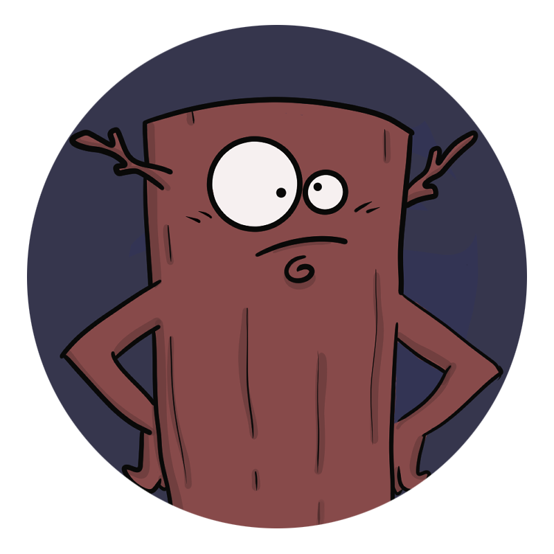

# Mr. Stick

<p align="center">

</p>

## Overview

Mr. Stick's Adventure is a captivating one-player game built with the **HTML5 Canvas API**, **CSS**, and **JavaScript**. Our hero, Mr. Stick, finds himself in a perilous factory, striving to survive against the odds. With hazards like saw traps and security drones on patrol bringing flamethrower, players will need both strategy and reflexes to navigate Mr. Stick to safety.

## Gameplay

Players control Mr. Stick as he makes his daring escape from the factory. The goal is to avoid saws and security drones' fire that patrol the area. You have all the
In Mr. Stick's Adventure, you guide our intrepid hero through a treacherous factory brimming with danger. The primary objective is to survive as long as possible while navigating through an ever-increasing array of hazards.

### Objectives

- **Survive**: Avoid environmental dangers such as saws and hazardous flamethrowers.
- **Combat**: Engage with security drones, known as 'patrullas', defeating them to earn points.

### Scoring

- Earn points by collecting coins scattered throughout the factory.
- Increase your score significantly by defeating the patrullas. Each patrulla taken down adds to your point tally, rewarding your offensive strategy.

### Controls

- **Spacebar**: Jump to avoid ground hazards or to take strategic advantage in combat.

Mastering the controls and understanding the patterns of the patrullas are key to achieving a high score.

## Features

- Smooth and responsive controls thanks to the Canvas API.
- Challenging gameplay that requires quick thinking and fast reflexes.
- Collectibles and power-ups to enhance the gaming experience.

## Technologies Used

- **HTML5 Canvas**: For rendering game graphics.
- **CSS3**: For styling and animations.
- **JavaScript**: For game logic and interactivity.

## Getting Started

To play Mr. Stick's Adventure, simply visit this [link](https://mr-stick.vercel.app/) and the game will load in your web browser.

To run the game locally:

1. Clone the repository:
   ```sh
   git clone [repository URL]
   ```

## Contribution

Contributions to Mr. Stick's Adventure are welcome! If you have ideas for how to improve the game or add new features, please follow these steps:

1. Fork the repository.
2. Create a new branch (git checkout -b feature-branch).
3. Commit your changes (git commit -am 'Add some feature').
4. Push to the branch (git push origin feature-branch).
5. Create a new Pull Request.

## Acknowledgments

Special thanks to Johnny Sola who contributed to the project as a illustrator.ˇ
